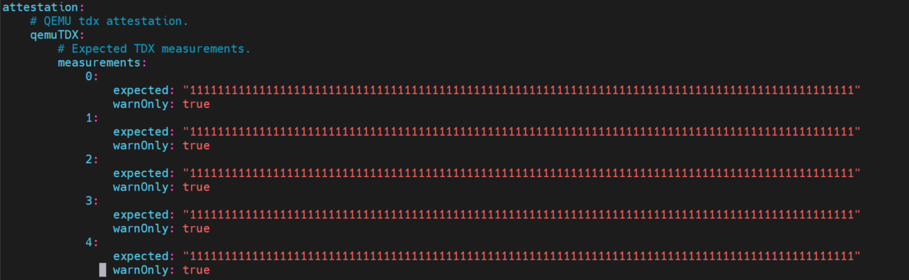

# Deployment Guide for Constellation based Confidential Cluster

This guide introduces the steps to deploy a confidential cluster through [Constellation](https://github.com/edgelesssys/constellation), which a project initiated by Edgeless Sys. Following the steps, users are able to create a Constellation cluster composing of several TDs created by QEMU on a bare metal TDX machine.

As mentioned in Constellation documentation, 

## Prerequisites

### Setup TDX host

Please follow the steps [here](https://github.com/canonical/tdx?tab=readme-ov-file#4-setup-tdx-host) to setup the TDX host.

### Check prerequisites and install dependencies

Check the following prerequisites:

* 20GB (minimum), better 40 GB disk space (required if you want to cross compile for all platforms)
* 16GB of unutilized RAM for a full Bazel build.
* [Latest version of Go](https://go.dev/doc/install).
* Unless you use Nix / NixOS: [Bazelisk installed as `bazel` in your path](https://github.com/bazelbuild/bazelisk/releases).
* We require Nix to be installed. It is recommended to install nix using the [determinate systems installer](https://github.com/DeterminateSystems/nix-installer) (or to use NixOS as host system).
* [Docker](https://docs.docker.com/engine/install/). Can be installed with these commands on Ubuntu 22.04: `sudo apt update && sudo apt install docker.io`. As the build spawns docker containers your user account either needs to be in the `docker` group (Add with `sudo usermod -a -G docker $USER`) or you have to run builds with `sudo`. When using `sudo` remember that your root user might (depending on your distro and local config) not have the go binary in it's PATH. The current PATH can be forwarded to the root env with `sudo env PATH=$PATH <cmd>`.


## Build Constellation

To leverage bare metal TDX machine to build up Constellation cluster, user need to apply several patches to the constellation repository. Follow the steps to build Constellation for QEMU TDX option:

### Step 1: Clone Constellation repo and apply patches.

Apply the patch to enable qemu-tdx within TDX bare-metal host using qemu.

The patch focusing on enabling the qemu-tdx option within Constellation.

The support for TDX attestation is done through the [go-tdx-qpl](https://github.com/Ruoyu-y/go-tdx-qpl) library which is a fork of Edgeless Sys's [go-tdx-qpl](https://github.com/edgelesssys/go-tdx-qpl) library. Most of the changes focusing the support of TDX 1.5 attestation and verifications. Since Constellation needs to specify the version and hash of dependencies within the code, these changes are directly applied within the patch.

```bash
# clone the constellation repo and apply patches.
git clone https://github.com/edgelesssys/constellation.git
git checkout fe65a6da76d03f0bed841ae36f33ff22d2567700
git checkout -b constellation-qemu-tdx
git apply ./constellation_qemu_tdx.patch
```

### (Optional) Step 2: Setup proxy if required
If user are building and running the confidential cluster under proxy, some files need to be modified to bypass the proxy issues.

Here listed the files that need to be modified:
```
# Add proxy setting to the files as environment variables
# e.g. add lines 'export http_proxy=<your_proxy>' to export http_proxy, https_proxy and no_proxy in the script
image/base/mkosi.skeleton/etc/profile.d/constellation.sh

# Add extra 'env' section in the configuration
# e.g. env = {"HTTP_PROXY": <your_proxy>, "HTTPS_PROXY": <your_proxy>, "NO_PROXY": <your_proxy>}
image/system/BUILD.bazel

# Add proxy as environment variables under the service section
# e.g. Environment="HTTP_PROXY=<your_proxy>". Add http_proxy, https_proxy and no_proxy
image/base/mkosi.skeleton/usr/lib/systemd/system/containerd.service.d/local.conf
image/base/mkosi.skeleton/usr/lib/systemd/system/kubelet.service

# Add proxy during execution
# e.g. ExecStart=/bin/bash -c "echo http_proxy=<your_proxy> >> /run/constellation.env". Echo http_proxy, https_proxy and no_proxy in the file.
image/sysroot-tree/usr/lib/systemd/system/configure-constel-csp.service
```

### Step 3: Build Constellation image for QEMU-TDX option
Build a Constellation image that works for QEMU-TDX option.

```bash
cd constellation
bazel build //image/system:qemu_qemu-tdx_stable
```

### Step 4: Build the Constellation CLI to startup confidential cluster

A Constellation CLI is required to bootstrap the confidential cluster. Follow the steps here to create a new image for the QEMU-TDX option.
```bash
mkdir build

cd build
# replace the container prefix to your hub prefix. e.g. docker.io/user/
bazel run //:devbuild --cli_edition=oss --container_prefix=<your-hub-prefix>/constellation
```

## Run Constellation

Now we are ready to run the Constellation confidential cluster. Follow the steps to setup the configuration and boot up the cluster.

```bash
# copy the prebuilt images to the build/ directory
cp ../bazel-bin/image/system/qemu_qemu-tdx_stable/constellation.* .

# create a image info file to hold the image path and remember to replace the username and path in the input.
cat > constellation_v2_ref_-_stream_stable_v2.17.0_image_info.json << EOF
{"ref":"-","stream":"stable","version":"v2.17.0","list":[{"csp":"QEMU","attestationVariant":"qemu-tdx","reference":"file:///home/<username>/<path>/constellation/build/constellation.raw"}]}
EOF

# generate a constellation-conf.yaml to hold all the configurations.
./constellation config generate qemu -a qemu-tdx
```

User need to modify the configuration before starting up the cluster. Modification required are listed here:

1. add `v2.17.0` as the value of `image`.
2. change the value of `libvirtSocket` to `qemu:///system` or path to local QEMU socket to leverage the local QEMU instead of docker.
3. check the value of `metadataAPIServer` and make sure it equals to the value you just pushed in the CLI generation step.
4. change the measurements of TDX like what shows in the picture



User could then use the simple command to start up the Constellation confidential cluster.
```bash
# add '--debug' flag to check the debug information
./constellation apply -y --debug
```

After one minute or two, user is able to find a working cluster on the machine using `virsh`:
```bash
virsh list | grep constell
constell-control-plane-322cc81a-0   running
constell-control-plane-322cc81a-1   running
constell-control-plane-322cc81a-2   running
constell-worker-60bb1fc2-0          running
```

## Clean up or start a new cluster
To clean up the confidential cluster started by the Constellation CLI. Use the steps below:
```bash
# terminate the cluster
./constellation terminate -y

# remove existing master secret before restarting a new cluster
rm -f constellation-mastersecret.json
```

