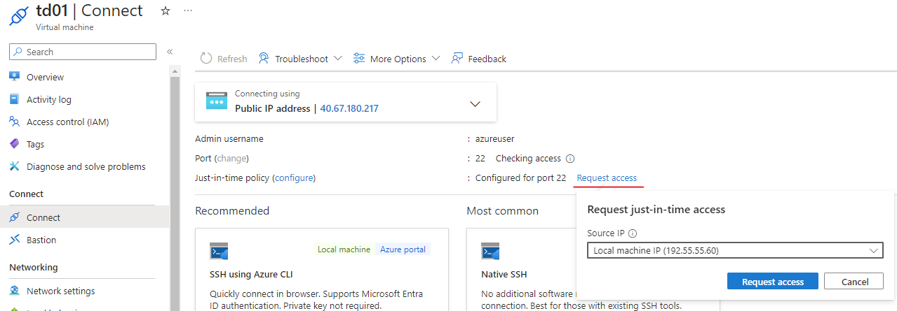

# Deployment Guide on CSP CVM

This guide introduces how to create a Intel TDX confidential VM (TD) on [Google cloud](https://cloud.google.com/?hl=en)
and [Azure](https://portal.azure.com/#home). Furthermore, it demonstrates how to collect measurement and create a Kubernetes cluster on the single CVM.

## Create CVM on Google Cloud Platform

### Prerequisite

1. Make sure you have account on Google cloud. 
2. Follow steps of [Before you begin](https://cloud.google.com/confidential-computing/confidential-vm/docs/create-a-confidential-vm-instance#before_you_begin) to prepare Google Cloud project, enable billing and install `gcloud CLI`.

__NOTE: When running `gcloud init` to set default region and zone. Set default region to `us-central1`, set default zone to `us-central1-a`, or `us-central1-b`, or `us-central1-c` as they are [supported zone](https://cloud.google.com/confidential-computing/confidential-vm/docs/supported-configurations#supported-zones) for TDX.__

### Create TD

Google Cloud doesn't support to create TD via UI console right now. Below steps will help you create TD instances via REST API. Find more details in the [document](https://cloud.google.com/confidential-computing/confidential-vm/docs/create-a-confidential-vm-instance#create-instance).

__NOTE: The following steps need to be performed in a session in which `gcloud init` has been executed successfully.__

1. Create ssh key pair. The public key will be used as metadata of the TD so that you can ssh the TD using private key.
  
  ```
   $ ssh-keygen
  ```

2. Reserve an external IP for the TD. Otherwise you cannot ssh it. You can find your `ProjectID` in the page of Google Cloud [console](https://console.cloud.google.com/).

  ```
  # create an external IP
  $ gcloud compute addresses create <IP NAME> --project=<YOUR PROJECT ID> --region=us-central1

  # get the external IP
  $ gcloud compute addresses list | grep <IP NAME> | awk '{print $2}'
  ```

3. Use [gcp_td.sh](./gcp_td.sh) to create a TD.

  ```
  $ ./gcp_td.sh -i <projectID> -n <vm name> -e <external IP from step 2> -u <ssh username> -k <content of public key from step 1>
  ```
__NOTE: The script uses image ubuntu-2204-jammy-v20240501. Find all TDX supported operating system image in the [document](https://cloud.google.com/confidential-computing/confidential-vm/docs/supported-configurations#operating-systems)__.

Below is an example response for a successful request. 

```
{
  "kind": "compute#operation",
  "id": "3130168573538985222",
  "name": "operation-1716279222227-618f272c98ade-029effcf-8c222ee8",
  "zone": "https://www.googleapis.com/compute/beta/projects/ccnp-412909/zones/us-central1-a",
  "operationType": "insert",
  "targetLink": "https://www.googleapis.com/compute/beta/projects/projectid/zones/us-central1-a/instances/temp",
  "targetId": "8235031474519272227",
  "status": "RUNNING",
  "user": "user@intel.com",
  "progress": 0,
  "insertTime": "2024-05-21T01:17:28.757-07:00",
  "startTime": "2024-05-21T01:17:28.758-07:00",
  "selfLink": "https://www.googleapis.com/compute/beta/projects/projectid/zones/us-central1-a/operations/operation-1716279447227-618f272c98ade-029effcf-8c440ee8"
}

```

After that, you can view the TD in Google Cloud Console - Compute Engine - Virtual machines - VM instances.

4. Connect to the TD. If you are behind a proxy, put below content in your config file before ssh TD.

```
$ vi ~/.ssh/config
Host td
    HostName <Replace with external IP of the TD>
    User <ssh username>
    Port 22
    PreferredAuthentications publickey
    IdentityFile <Replace with path of ssh private key>
    ProxyCommand connect-proxy -S <Replace with your proxy>:1080 %h %p

$ ssh td
```

## Create CVM on Azure

### Prerequisite

1. Make sure you have account on Azure. 
2. [Create a resource group](https://portal.azure.com/#create/Microsoft.ResourceGroup) or using an existing resource group.

### Create TD

Create TD via Azure portal following the [guide](https://learn.microsoft.com/en-us/azure/confidential-computing/quick-create-confidential-vm-portal).

__NOTE:__

- `Region`: choose a region amoung `West Europe`, `Central US`, `East US 2` and `North Europe` for Intel TDX. Please find more details at [DCesv5 and DCedsv5-series VMs](https://learn.microsoft.com/en-us/azure/virtual-machines/dcesv5-dcedsv5-series) and [ECesv5 and ECedsv5-series VMs](https://learn.microsoft.com/en-us/azure/virtual-machines/ecesv5-ecedsv5-series)._

- `Authentication type`: You can choose either `SSH public key` or `Password`. If `SSH public key` is chosen, a private key will be downloaded later for SSH connectivity.

- `Inbound port rules`: Set `Public inbound ports` to `None` or it will fail to review the request. The network settings can update later.


### Connect TD

After the TD is created successfully, click the VM name and go to its overview. Click `Connect` and `Request access` for your local machine IP. Then click `Check access` and make sure it's accessible. Please see below diagram.



At this point, you should be able to ssh the TD using a ssh tool, such as `Putty`.


If you are behind a proxy, click `Network settings`. Click `Create port rule` - `Inbound port rule`. 
- Input your proxy external IP to the `Source IP addresses/CIDR ranges`.
- Input your VM's private IP ad `Destination IP addresses/CIDR ranges`. 

Please see other fields in below diagram.


Add below section to `~/.ssh/config`.
```
$ vi ~/.ssh/config
Host td
    HostName <Replace with external IP of the TD>
    User <ssh username>
    Port 22
    PreferredAuthentications publickey
    IdentityFile <Replace with path of ssh private key>
    ProxyCommand connect-proxy -S <Replace with your proxy>:1080 %h %p

$ ssh td
```

## Gather Measurement, Event log and Quote

### Get measurement

[CC Trusted API](https://github.com/cc-api/cc-trusted-api) and [VMSDK](https://github.com/cc-api/cc-trusted-vmsdk) supports to gather measurement, event logs for the TD via vTPM. 

Please refer to the [steps](https://github.com/cc-api/cc-trusted-vmsdk) to check the measurement and event logs via vTPM.

### Get Quote

VMSDK has not supported getting quote yet. Please run below steps in the TD to get quote using [Intel ITA client for GCP](https://github.com/intel/trustauthority-client-for-go/tree/gcp-tdx-preview/tdx-cli) or [Intel ITA client for Azure](https://github.com/intel/trustauthority-client-for-go/tree/azure-tdx-preview/tdx-cli).

#### GCP TD

1. Follow the [guide](https://cloud.google.com/confidential-computing/confidential-vm/docs/attestation#intel_tdx_on_ubuntu) to enable `tdx_guest` module. Reboot the TD to make sure the module is loaded.

2. Get quote via ITA client.

  ```
  $ curl -L https://github.com/intel/trustauthority-client-for-go/releases/download/v1.2.1/trustauthority-cli-gcp-v1.2.1.tar.gz -o trustauthority-cli.tar.gz
  $ tar xvf trustauthority-cli.tar.gz

  $ sudo apt install build-essential
  $ sudo snap install go --classic

  $ sudo ./trustauthority-cli quote
  ```
  
#### Azure TD

1. Follow the [guide](https://cloud.google.com/confidential-computing/confidential-vm/docs/attestation#intel_tdx_on_ubuntu) to enable `tdx_guest` module. Reboot the TD to make sure the module is loaded.

2. Get quote via ITA client. Find more details at [here](https://github.com/intel/trustauthority-client-for-go/blob/azure-tdx-preview/tdx-cli/README.md)

  ```
  $ sudo apt-get update
  $ curl -sL https://raw.githubusercontent.com/intel/trustauthority-client-for-go/main/release/install-tdx-cli-azure.sh | sudo bash -
  $ sudo trustauthority-cli quote
  ```

## Install Kubernetes

It's recommended to use [k3s](https://docs.k3s.io/) to start a lightweight Kubernetes cluster for experimental purpose. Or you can refer to the [Kubernetes official documentation](https://kubernetes.io/docs/home/) to setup a cluster.

Use below command to start a lightweight Kubernetes cluster using k3s.

```
$ curl -sfL https://get.k3s.io | sh -
```

After k3s service is up successfully, run below command.

```
$ export KUBECONFIG=/etc/rancher/k3s/k3s.yaml
```
Check node status with below command. You can see current node status is ready.

```
$ kubectl get node
NAME     STATUS   ROLES                  AGE   VERSION
td       Ready    control-plane,master   4s    v1.29.4+k3s1
```
